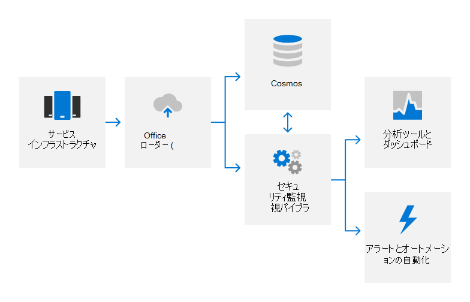

# 監査ログの概要

## 監査ログMicrosoft 365を使用する方法

Microsoft 365監査ログを使用して、製品およびサービスの未承認のアクティビティを検出し、Microsoft の担当者に説明責任を提供します。 監査ログは、システム構成の変更とアクセス イベントに関する詳細をキャプチャし、アクティビティの責任者、アクティビティがいつどこで行ったか、アクティビティの結果を特定するための詳細を示します。 ログの自動分析は、疑わしい動作のほぼリアルタイム検出をサポートします。 潜在的なインシデントは、セキュリティ対応チームMicrosoft 365調査のためにエスカレートされます。

Microsoft 365監査ログは、次のようなさまざまなソースからのログ データをキャプチャします。

- イベント ログ
- AppLocker ログ
- パフォーマンス データ
- System Centerデータ
- 通話詳細レコード
- エクスペリエンス データの品質
- IIS Web Server ログ
- SQL Serverログ
- Syslog データ
- セキュリティ監査ログ

## 監査ログMicrosoft 365一元化してレポートする方法

Microsoft 365 サーバーから、ほぼリアルタイム (NRT) 分析用の独自のセキュリティ監視ソリューション、および長期ストレージ用の内部ビッグ データ コンピューティング サービス (Cosmos) に、さまざまな種類のログ データがアップロードされます。 このデータ転送は、Office データ ローダー (ODL) と呼ばれる独自のオートメーション ツールを使用して、承認済みポートおよびプロトコル上の FIPS 140-2 検証済み TLS 接続を使用して行われます。

ログは、ルールベース、統計、および機械学習の方法を使用して NRT で処理され、システム パフォーマンス インジケーターと潜在的なセキュリティ イベントを検出します。 機械学習モデルは、受信ログ データと履歴ログ データを使用して、Cosmos機能を継続的に向上します。 セキュリティ関連の検出では、アラートが生成され、インシデントが発生する可能性がある場合はオンコール エンジニアに通知し、該当する場合は自動修復アクションをトリガーします。 サービス チームは、自動化されたセキュリティ監視に加えて、分析ツールとダッシュボードを使用して、データの相関関係、対話型クエリ、およびデータ分析を行います。 これらのレポートは、サービスの全体的なパフォーマンスを監視および改善するために使用されます。

セキュリティ監視とアラートの詳細については、「セキュリティ監視の概要 [」を参照してください](assurance-security-monitoring.md)。

## 監査ログMicrosoft 365保護する方法

監査レコードを収集Microsoft 365処理するために使用されるツールでは、元の監査レコードのコンテンツや時間の順序に対する永続的または不可逆的な変更は許可されません。 ユーザーにMicrosoft 365データへのアクセスは、Cosmos担当者に制限されます。 さらに、Microsoft 365ログの管理を、監査機能を担当するセキュリティ チーム メンバーの限定されたサブセットに制限します。 セキュリティ チームは、管理者に対する永続的な管理Cosmos。 管理アクセスには Just-In-Time (JIT) アクセスの承認が必要であり、ユーザーのログメカニズムに対する変更Cosmos記録および監査されます。 監査ログは、インシデント調査をサポートし、規制要件を満たすのに十分な時間保持されます。 監査ログ データ保持の正確な期間は、Cosmosチームによって決定されます。ほとんどの監査ログ データは 90 日以上保持されます。

## 監査ログMicrosoft 365取り込む可能性があるエンド ユーザー識別可能な情報を保護する方法

ログ データをアップロードする前に、ODL アプリケーションはスクラブ サービスを使用して、テナント情報やエンドユーザー識別可能な情報など、顧客データを含むフィールドを削除し、それらのフィールドをハッシュ値に置き換える。 匿名化およびハッシュ化されたログは、書き換え後、そのログにアップロードCosmos。 すべてのログ転送は、TLS 暗号化接続 (FIPS 140-2) を使用して行われます。

## 関連する外部規制&認定

Microsoft のオンライン サービスは、定期的に外部の規制と認定に準拠した監査を受けています。 監査ログに関連するコントロールの検証については、次の表を参照してください。

| **外部監査** | **Section** | **最新のレポート日付** |
|:--------------------|:------------|:-----------------------|
| [FedRAMP (Office 365)](https://compliance.microsoft.com/compliancemanager) | AU-2: 監査イベント   AU-3: 監査レコードの内容   AU-4: ストレージ容量の監査   AU-5: 監査処理の失敗に対する応答   AU-6: 監査レビュー、分析、およびレポート   AU-7: 監査の削減とレポート生成   AU-8: タイム スタンプ   AU-9: 監査情報の保護    AU-10: 否認不可   AU-11: 監査レコードの保持   AU-12: 監査の生成  | 2020 年 9 月 24 日 | 
| [ISO 27001/27002 (Office 365)](https://servicetrust.microsoft.com/ViewPage/MSComplianceGuideV3?command=Download&downloadType=Document&downloadId=8d625374-4f2d-49f8-9d37-a4281ba98222&tab=7027ead0-3d6b-11e9-b9e1-290b1eb4cdeb&docTab=7027ead0-3d6b-11e9-b9e1-290b1eb4cdeb_ISO_Reports)    [適用性のステートメント](https://servicetrust.microsoft.com/ViewPage/MSComplianceGuideV3?command=Download&downloadType=Document&downloadId=c0df4ce8-c77e-4183-84eb-c8688470d8b1&tab=7027ead0-3d6b-11e9-b9e1-290b1eb4cdeb&docTab=7027ead0-3d6b-11e9-b9e1-290b1eb4cdeb_ISO_Reports)   [認定](https://servicetrust.microsoft.com/ViewPage/MSComplianceGuideV3?command=Download&downloadType=Document&downloadId=1e84a14a-2468-45ac-9412-5e53250d57ec&tab=7027ead0-3d6b-11e9-b9e1-290b1eb4cdeb&docTab=7027ead0-3d6b-11e9-b9e1-290b1eb4cdeb_ISO_Reports) | A.12.4: ログと監視 | 2021 年 4 月 20 日 |
| [ISO 27017 (Office 365)](https://servicetrust.microsoft.com/ViewPage/MSComplianceGuideV3?command=Download&downloadType=Document&downloadId=8d625374-4f2d-49f8-9d37-a4281ba98222&tab=7027ead0-3d6b-11e9-b9e1-290b1eb4cdeb&docTab=7027ead0-3d6b-11e9-b9e1-290b1eb4cdeb_ISO_Reports)    [適用性のステートメント](https://servicetrust.microsoft.com/ViewPage/MSComplianceGuideV3?command=Download&downloadType=Document&downloadId=c0df4ce8-c77e-4183-84eb-c8688470d8b1&tab=7027ead0-3d6b-11e9-b9e1-290b1eb4cdeb&docTab=7027ead0-3d6b-11e9-b9e1-290b1eb4cdeb_ISO_Reports)   [認定](https://servicetrust.microsoft.com/ViewPage/MSComplianceGuideV3?command=Download&downloadType=Document&downloadId=70de0999-5451-43a3-9ef4-761e8fbfb1a3&tab=7027ead0-3d6b-11e9-b9e1-290b1eb4cdeb&docTab=7027ead0-3d6b-11e9-b9e1-290b1eb4cdeb_ISO_Reports) | A.12.4: ログと監視 | 2021 年 4 月 20 日 |
| [SOC 1 (Office 365)](https://servicetrust.microsoft.com/ViewPage/MSComplianceGuideV3?command=Download&downloadType=Document&downloadId=90df3f9c-3aaf-4dbf-99d0-ca9f2991721b&tab=7027ead0-3d6b-11e9-b9e1-290b1eb4cdeb&docTab=7027ead0-3d6b-11e9-b9e1-290b1eb4cdeb_SOC_%2F_SSAE_16_Reports) | CA-48: データセンターログ   CA-60: 監査ログ | 2020 年 12 月 24 日 |
| [SOC 2 (Office 365)](https://servicetrust.microsoft.com/ViewPage/MSComplianceGuideV3?command=Download&downloadType=Document&downloadId=a73c1738-7892-42b7-acd3-87b6371c53f6&tab=7027ead0-3d6b-11e9-b9e1-290b1eb4cdeb&docTab=7027ead0-3d6b-11e9-b9e1-290b1eb4cdeb_SOC_%2F_SSAE_16_Reports) | CA-48: データセンターログ   CA-60: 監査ログ | 2020 年 12 月 24 日|