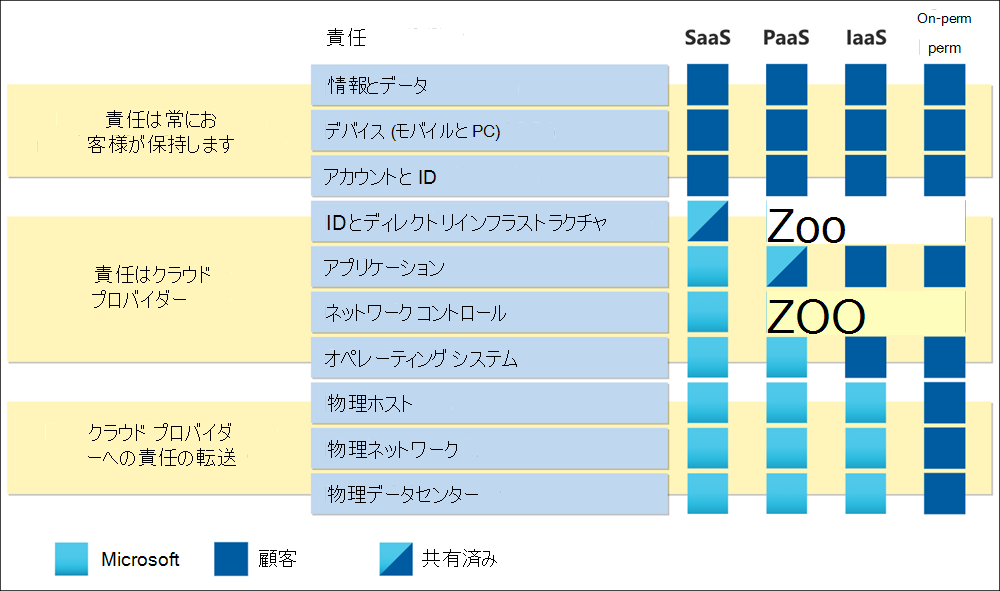

# Microsoft Cloud のリスク評価ガイド

クラウド リスク評価の目標は、クラウドへの移行のために考慮されるシステムとデータが、組織に新しいリスクや未確認のリスクを導入しなかねない点を確認することです。 焦点は、情報処理の機密性、整合性、可用性、プライバシーを確保し、特定されたリスクを許容される内部リスクしきい値以下に保つためにです。

共有責任モデルでは、クラウド サービス プロバイダー (CSP) が、プロバイダーとしてのクラウドのセキュリティとコンプライアンスを管理します。 お客様は、ニーズとリスク許容度に従ってクラウドのセキュリティとコンプライアンスを管理および構成する責任を負います。

このガイドでは、ベンダー のリスクを効率的に評価する方法と、Microsoft が利用できるリソースとツールの使い方について、ベスト プラクティスを共有しています。

## クラウドでの共有の責任を理解する

クラウド展開は、サービスとしてのインフラストラクチャ (IaaS)、サービスとしてのプラットフォーム (PaaS)、またはサービスとしてのソフトウェア (SaaS) として分類できます。 該当するクラウド サービス モデルに応じて、ソリューションのセキュリティ制御に対する責任のレベルは、CSP と顧客の間で変化します。 従来のオンプレミス モデルでは、顧客はスタック全体を担当します。 クラウドに移行すると、すべての物理的なセキュリティ責任が CSP に転送されます。 組織のクラウド サービス モデルに応じて、追加の責任が CSP に移行します。 ただし、ほとんどのサービス モデルでは、クラウド、ネットワーク接続、アカウントと ID、およびデータへのアクセスに使用されるデバイスに対して、組織が引き続き責任を負います。 Microsoft は、顧客がライフサイクル全体にわたってデータを管理できるサービスの作成に多額の投資を行っています。

Microsoft Cloud は、DevSecOps とオートメーションを組み合わせて運用モデルを標準化することにより、ハイパースケールで動作します。 Microsoft の運用モデルは、従来のオンプレミスの運用モデルと比較してリスクにアプローチする方法を変更し、リスクを管理するための異なる、時には見慣れないコントロールを実装します。 クラウド リスク評価を実施する場合、Microsoft の目標は、すべてのリスクに対処し、必ずしも組織が行うのと同じコントロールを実装するわけではないことを念頭に置いておきます。 Microsoft は、異なる一連のコントロールで同じリスクに対処し、クラウド リスク評価に反映する必要があります。 強力な予防制御を設計および実装すると、探偵コントロールと修正コントロールに必要な作業の多くを削減できます。 この例は、ゼロ スタンディング アクセス [(ZSA)](assurance-microsoft-365-service-engineer-access-control.md)の Microsoft の実装です。

## フレームワークの採用

Microsoft では、お客様が社内リスクと制御フレームワークを、標準化された方法でクラウド リスクに対応する独立したフレームワークにマップする必要があります。 既存の内部リスク評価モデルがクラウド コンピューティングに伴う特定の課題に対処しない場合は、これらの広範に採用され標準化されたフレームワークの恩恵を受ける可能性があります。 もう 1 つの利点は、Microsoft が、リスク評価を加速させるドキュメントとツールでこれらのフレームワークに対するマッピングを提供する点です。 これらのフレームワークの例には[、ISO 27001 情報](/compliance/regulatory/offering-iso-27001)セキュリティ標準[、CIS ベンチマーク](/compliance/regulatory/offering-cis-benchmark)[、NIST SP 800-53](https://csrc.nist.gov/Projects/risk-management/sp800-53-controls/release-search#!/800-53)があります。 Microsoft は、CSP のコンプライアンスに関する最も包括的な一連のサービスを提供しています。 詳細については、「Microsoft コンプライアンス製品 [」を参照してください](/compliance/regulatory/offering-home)。

[Microsoft Compliance Manager を使用](/microsoft-365/compliance/compliance-manager)して、組織に適用される業界および地域の規制への準拠を評価する独自の評価を作成します。 評価は、必要なコントロール、改善アクション、および該当する場合は、評価を完了するための Microsoft のアクションを含む評価テンプレートのフレームワークに基いて構築されます。 Microsoft のアクションでは、詳細な実装計画と最近の監査結果が提供されます。 これにより、ファクト検索、マッピング、および Microsoft による特定のコントロールの実装方法の調査に時間を保存できます。 詳細については、「Microsoft コンプライアンス マネージャー」の記事を参照してください。

## Microsoft がデータを保護する方法を理解する

顧客はクラウドでのセキュリティとコンプライアンスの管理と構成を担当しますが、CSP はクラウドのセキュリティとコンプライアンスを *管理する責任があります*。 CSP が効果的に責任に取り組み、約束を守っているのを検証する方法の 1 つは、ISO や SOC などの外部監査レポートを確認する方法です。 Microsoft では、サービス信頼ポータルで認証対象ユーザーが外部監査 [レポートを利用できます](https://servicetrust.microsoft.com/ViewPage/MSComplianceGuideV3)。

Microsoft では、外部監査レポートに加えて、Microsoft の詳細な運用方法を理解するために、次のリソースを活用することを強くお勧めしています。

- [On-demand ラーニングパス](/learn/roles/auditor): Microsoft の Learn プラットフォームは、さまざまなトピックに関する何百もの学習パスとモジュールを提供します。 その中で [、「Microsoft](/learn/paths/audit-safeguard-customer-data/) が顧客データを保護して Microsoft の基本的なセキュリティとプライバシーのプラクティスを理解する方法」を参照してください。

- [Microsoft コンプライアンスのサービス アシュア](/compliance/#service-assurance)ランス: Microsoft のプラクティスに関する記事は、レビューを容易にするために 16 ドメインに分類されます。 各ドメインには、Microsoft が各領域に関連付けられているリスクを管理する方法をキャプチャする概要が含まれています。 監査テーブルには、サービス信頼ポータルに保存されている最新のレポートへのリンク、関連するセクション、および Microsoft オンライン サービスに対して監査レポートが実施された日付が含まれています。 利用可能な場合は、サードパーティの脆弱性評価やビジネス継続性計画検証レポートなど、制御の実装を示す成果物へのリンクが提供されます。 監査レポートと同様に、これらの成果物は STP でホストされ、アクセスするには認証が必要です。

| **ドメイン** |**説明** |
|:---------- |:-------------- |
| [**アーキテクチャ**](assurance-architecture.md) | Microsoft オンライン サービスの設計と、その基盤として機能するセキュリティ原則。 |
| [**監査ログ**](assurance-audit-logging.md) | Microsoft がセキュリティとパフォーマンスの監視を可能にするログをキャプチャ、処理、保存、および保護する方法。 |
| [**データセンターのセキュリティ**](assurance-datacenter-security.md) | Microsoft が世界中で Microsoft オンライン サービスを運用する手段を提供するデータセンターを安全に運用する方法。 |
| [**暗号化とキー管理**](assurance-encryption.md) | 顧客通信の暗号化保護と、クラウドに保存および処理されたデータ。 |
| [**ガバナンス**](assurance-governance.md) | Microsoft が顧客の約束とコンプライアンス要件を満たすために、企業全体でセキュリティ ポリシーを作成、配布、更新、適用する方法。 |
| [**人事管理**](assurance-human-resources.md) | Microsoft での時間を通じて、従業員のスクリーニング プロセスと安全な管理を行います。 |
| [**ID およびアクセス管理**](assurance-identity-and-access-management.md) | Microsoft のオンライン サービスと顧客データを、承認されていないアクセスまたは悪意のあるアクセスから保護します。 |
| [**インシデント管理**](assurance-incident-management.md) | Microsoft がすべてのセキュリティおよびプライバシー インシデントの準備、検出、対応、および通信に使用するプロセス。 |
| [**ネットワーク セキュリティ**](assurance-network-security.md) | Microsoft が外部攻撃からネットワーク境界を保護し、内部ネットワークを管理して伝達を制限する方法。 |
| [**プライバシー**](assurance-privacy.md) | Microsoft がデータ権限を保持するために顧客データを処理および保護する方法。 |
| [**回復性および継続性**](assurance-resiliency-and-continuity.md) | サービスの可用性を維持し、ビジネスの継続性と回復を確保するために使用されるプロセスとテクノロジ。 |
| [**リスク管理**](assurance-risk-management.md) | 企業全体のリスクを最小限に抑えるために実行される識別、評価、およびアクション。 |
| [**セキュリティ開発と運用**](assurance-security-development-and-operation.md) | Microsoft がサービスをライフサイクル全体にわたって安全に設計、実行、管理する方法。 |
| [**セキュリティ監視**](assurance-security-monitoring.md) | ログの中央分析により、権限のないアクティビティや悪意のあるアクティビティを従業員に検出して警告します。 |
| [**サプライヤー管理**](assurance-supplier-management.md) | Microsoft が Microsoft オンライン サービスを支援するサードパーティ企業を画面表示および管理する方法。 |
| [**脆弱性管理**](assurance-vulnerability-management.md) | Microsoft が脆弱性とマルウェアのスキャン、検出、対処に使用するプロセス。 |

## リソース

- [Microsoft Cloud の金融機関のリスク評価とコンプライアンス ガイド](https://servicetrust.microsoft.com/ViewPage/TrustDocumentsV3?command=Download&downloadType=Document&downloadId=edee9b14-3661-4a16-ba83-c35caf672bd7&tab=7f51cb60-3d6c-11e9-b2af-7bb9f5d2d913&docTab=7f51cb60-3d6c-11e9-b2af-7bb9f5d2d913_FAQ_and_White_Papers)
- [集中リスク: Microsoft からの視点](https://azure.microsoft.com/mediahandler/files/resourcefiles/concentration-risk-perspectives-from-microsoft-/Concentration_Risk_Perspectives_092020.pdf)
- [Service Trust Portal](https://servicetrust.microsoft.com/)
