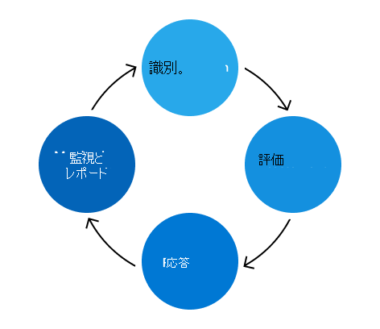

# Microsoft 365リスク管理プログラム

リスク管理プログラムMicrosoft 365目的は、リスクを特定、評価、および管理Microsoft 365。 Microsoft 365の優先事項は、契約上の義務と認定を満たし、顧客の信頼を高め、競争力を維持します。 Microsoft 365リスク管理プログラムは独立して機能しますが、包括的な Enterprise リスク管理 (ERM) プログラムのポリシー、優先順位、および方法に合わせて調整されます。 ERM プログラムを使用すると、ビジネス ユニットとエンジニアリング グループ間で一貫した比較が可能になります。企業全体のリスク管理に対するより一貫性のあるアプローチに貢献します。

セキュリティMicrosoft 365チームは、リスク管理プログラムMicrosoft 365、ERM プログラムによってレイアウトされたアクティビティを実行する責任があります。 信頼チームは、リスク管理プログラムをより効果的かつ効率的に行うMicrosoft 365エンジニアリング、サービス運用、コンプライアンス プロセスにリスク管理フレームワークを統合します。

また、信頼チームは Microsoft 365 Controls Framework を維持しています。一連の合理化されたコントロールは、コンプライアンス活動をサポートして適切に実装すると、エンジニアリング チームが主要な規制と認定に準拠できます。 このフレームワークは、リスク管理プロセスの一環としてフィードバックと調査結果に基づいて継続的に更新されます。

リスク管理アクティビティは、識別、評価、対応、監視と報告の 4 つのフェーズに分かっています。

## ID

リスク管理プロセスは、すべての主要な制御領域、内部および外部の脅威、およびセキュリティ環境の脆弱性に対して考えられるすべてのリスクをMicrosoft 365します。 このプロセスを導く情報は、インタビュー、脆弱性スキャン、攻撃シミュレーション演習、監査結果、インシデント管理アクティビティなど、複数のソースから取得されます。

信頼チームは、以前に特定されたリスクと、サービスの成長に伴って導入される可能性のある将来のリスクについて、複数のサービス チームから件名の専門家 (SMEs) にインタビューします。 さらに、中小企業は、他の継続的な監視ソースから特定されたリスクの正確性と完全性を検証するのに役立ちます。

また、意思決定ログ、アクティブ なセキュリティとコンプライアンスの例外、以前のリスク評価からの軽減作業を確認する場合も識別フェーズです。

## 評価

特定された各リスクは、影響、可能性、および制御の欠陥という 3 つの指標を使用して評価されます。

- 影響とは、そのリスクを実現する場合にサービス、ビジネス、または Microsoft に発生する損害を指します。 Microsoft への影響には、評判の損害、顧客の喪失、法令遵守への影響が含まれる場合があります。
- 可能性は、潜在的なリスクが実現される確率を定義し、発生する確率と頻度を分析することによって計算されます。
- コントロールの不足は、実装された軽減制御の有効性を測定します。

これらの指標は、既存の軽減戦略を説明し、各リスクの重大度を表すリスク スコアを計算するために使用されます。 リスクは、各サービスの主要な関係者に集約され、各サービスの主要な関係者に提示され、Microsoft 365のリスク態勢の正確性と完成度を確認します。

## 応答

信頼チームは、リスクの検証済みリストを使用Microsoft 365、影響を受けるサービスにリスクを割り当て、リスク対応を行います。 定義されたガイドラインは、リスク スコアと制御の有効性に基づいて適切なリスク対応戦略を決定するのに役立ちます。 リスク対応戦略は、次の 4 つのカテゴリに分類されます。

- 許容: 漏えいの危険度が低い領域で、制御レベルも低い場合。
- 処理: 漏えいの危険度が低い領域で、制御が適切だとみなされる場合。
- 監視: 漏えいの危険度が高い領域で、制御が適切であり、監視が有効だとみなされる場合。
- 改善: 対処の最優先事項である低レベルの制御を伴うリスクの高い露出の領域。

信頼チームは、サービス チームと調整して、各リスクに対処する計画を策定します。 重大度レベルは、各計画の適切なレベルのレビューと承認を決定します。 アクションが必要なリスクについては、既存のエンジニアリング バグ プロセスを使用して、例外の決定を追跡、管理、および行います。 エンジニアリングチームと運用チームに慣れ親しんだプロセスを使用すると、リスク対応の効率と効率が向上します。

## 監視とレポート

リスク評価の一環として特定されたリスクを監視し、関連する関係者へと報告を行います。 監視戦略には、セキュリティの監視、定期的なリスクの確認、侵入テスト、脆弱性のスキャンが含まれます。 これらの監視の取り組みは、主要業績評価指標に関するレポート作成、ダッシュボードの作成、および正式なレポートの開発のためのデータ ソースとして機能し、そのすべてが将来のリスクの決定を通知します。

年に複数回、信頼チームは各サービスのリスク所有者と会い、リスク スコアを確認し、アクション プランの有効性を評価し、必要に応じて更新を行います。 さらに、Microsoft 365 のリスク評価活動は、Microsoft の上級管理職および ERM プログラムに対する Microsoft のリスク態勢の概要を示す、ERM プログラムの Enterprise リスク評価に貢献します。
