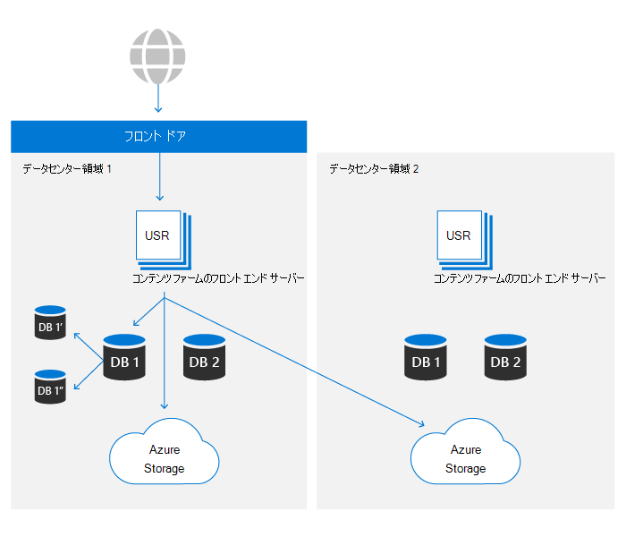

# Microsoft 365 での SharePoint と OneDrive のデータの復元性

このMicrosoft 365、OneDriveファイル プラットフォームの上にSharePointされます。 この記事では、両方SharePoint参照するために使用される情報のみを示します。 この記事の内容は、Microsoft 365に関連し、コンシューマー サービスには適用されません。

コンテンツ のコア コンテンツ ストレージを構成する主なアセットは次の 2 SharePoint。

- **メタデータ**: 各ファイルに関するメタデータは、Azure SQL Database。 Azure SQLは、この記事で後で説明SharePoint詳細を説明する完全なビジネス継続性ストーリーを提供します。
- **BLOB ストレージ**: ユーザー コンテンツがアップロードされ、SharePointにAzure Storage。 SharePointユーザー コンテンツのほぼリアルタイムの重複と、本当にアクティブ/アクティブなシステムを確保するために、Azure Storage の上にカスタムの復元計画を構築しました。

データの回復性を確保するためのコントロールの完全なセットについては、詳細なセクションで説明します。

## BLOB ストレージの復元

SharePointには、顧客データをカスタムビルドで保存するソリューションAzure Storage。 すべてのファイルは、プライマリ データセンター領域とセカンダリ データセンター領域の両方に同時に書き込まれます。 いずれかの Azure 領域への書き込みに失敗すると、ファイルの保存は失敗します。 コンテンツが Azure Storage に書き込まれると、チェックサムはメタデータと個別に格納され、コミットされた書き込みは、将来のすべての読み取り中に SharePoint に送信された元のファイルと同じになります。 この同じ手法は、発生する必要がある破損の伝達を防止するために、すべてのワークフローで使用されます。 各地域内で、Azure Locally Redundant Storage (LRS) は高レベルの信頼性を提供します。 詳細については[、「Azure Storage冗長性」](/azure/storage/common/storage-redundancy-lrs)の記事を参照してください。

SharePointストレージをAppend-Onlyします。 このプロセスにより、初期保存後にファイルを変更したり破損したりすることはできませんが、製品内バージョン管理を使用すると、以前のバージョンのファイルコンテンツを取得できます。

SharePointの環境では、両方の Azure リージョンのストレージ コンテナーにアクセスできます。 パフォーマンス上の理由から、同じローカル データセンター内のストレージ コンテナーが常に優先されます。ただし、目的のしきい値内に結果が表示されない読み取り要求は、データが常に使用可能なことを確認するために、リモート データセンターから要求されたコンテンツと同じになります。

## メタデータの復元

SharePointメタデータは、ユーザー コンテンツに格納されているコンテンツの場所とアクセス キーを格納する場合にも重要Azure Storage。 これらのデータベースは Azure SQLに格納され、広範なビジネス継続[性計画があります](/azure/sql-database/sql-database-business-continuity)。

SharePoint Azure SQL が提供するレプリケーション モデルを使用し、独自のオートメーション テクノロジを構築してフェールオーバーが必要かどうかを判断し、必要に応じて操作を開始します。 そのため、Azure の観点から見ると、"手動データベース フェールオーバー" カテゴリSQLされます。 データベースの回復性に関する Azure SQLの指標については、こちらを参照[してください](/azure/azure-sql/database/business-continuity-high-availability-disaster-recover-hadr-overview#recover-a-database-to-the-existing-server)。

SharePoint Azure SQLのバックアップ システムを使用して、ポイント イン タイム 復元 (PITR) を最大 14 日間有効にしています。 PITR の詳細については、後のセクション [で説明します。](#deletion-backup-and-point-in-time-restore)

## 自動フェールオーバー

SharePointカスタムビルドの自動フェールオーバーを使用して、場所固有のイベントが発生した場合のカスタマー エクスペリエンスへの影響を最小限に抑えます。 特定のしきい値を超える単一または複数コンポーネントの障害を検出する監視駆動型の自動化により、すべてのユーザーのアクティビティが問題のある環境からウォーム セカンダリに自動的にリダイレクトされます。 フェールオーバーによって、メタデータとコンピューティング ストレージが新しいデータセンターから完全に提供されます。 BLOB ストレージは常に完全にアクティブ/アクティブに実行されます。フェールオーバーには変更は必要ありません。 コンピューティング層は最も近い BLOB コンテナーを優先しますが、可用性を確保するために、いつでもローカルとリモートの両方の BLOB ストレージの場所を使用します。

SharePoint Azure Front Door サービスを使用して、Microsoft ネットワークへの内部ルーティングを提供します。 この構成により、DNS に依存しないフェールオーバー リダイレクトが可能であり、ローカル マシン キャッシュの影響が軽減されます。 ほとんどのフェールオーバー操作は、エンド ユーザーに対して透過的です。 フェールオーバーがある場合は、サービスへのアクセスを維持するために変更を加える必要が生じしません。

## バージョン管理とファイルの復元

新しく作成されたドキュメント ライブラリの場合SharePointファイルごとに既定で 500 バージョンに設定され、必要に応じてさらにバージョンを保持するように構成できます。 UI では、100 バージョン未満の値を設定できますが、パブリック API を使用してより少ないバージョンを格納するシステムを設定できます。 信頼性を確保するには、100 未満の値は推奨されません。ユーザー アクティビティによってデータが不注意に失われる可能性があります。

バージョン管理の詳細については、「バージョン管理」[を参照SharePoint。](/microsoft-365/community/versioning-basics-best-practices)

[ファイルの復元] は、過去 30 日間に SharePoint で任意のドキュメント ライブラリで "時間内に戻る" 機能です。 このプロセスは、ランサムウェア、大量削除、破損、その他のイベントから回復するために使用できます。 この機能ではファイル バージョンが使用されます。そのため、既定のバージョンを減らすと、この復元の効果が低下します。

[ファイルの復元] 機能は、ファイルの復元OneDrive[と](https://support.office.com/article/restore-your-onedrive-fa231298-759d-41cf-bcd0-25ac53eb8a15)SharePoint。

## 削除、バックアップ、およびポイントインタイムの復元

ユーザー から削除されたユーザー SharePointは、次の削除フローを通過します。

削除されたアイテムは、一定の期間、ごみ箱に保持されます。 このSharePoint保持期間は 93 日です。 元の場所からアイテムを削除すると開始されます。 サイトのごみ箱からアイテムを削除すると、サイト コレクションのごみ箱 [に移動します](https://support.office.com/article/restore-deleted-items-from-the-site-collection-recycle-bin-5fa924ee-16d7-487b-9a0a-021b9062d14b)。 残りの 93 日間はそのまま残り、完全に削除されます。 ごみ箱を使用する方法の詳細については、次のリンクを参照してください。

- [ごみ箱のアイテムを復元する](https://support.office.com/article/Restore-items-in-the-Recycle-Bin-of-a-SharePoint-site-6df466b6-55f2-4898-8d6e-c0dff851a0be)
- [サイト コレクションのごみ箱から削除済みアイテムを復元します](https://support.office.com/article/Restore-deleted-items-from-the-site-collection-recycle-bin-5fa924ee-16d7-487b-9a0a-021b9062d14b)。

このプロセスは既定の削除フローであり、保持ポリシーやラベルは考慮されません。 詳細については、「ユーザーとユーザー[の保持についてSharePoint」をOneDrive。](/microsoft-365/compliance/retention-policies-sharepoint)

93 日間のリサイクル パイプラインが完了すると、メタデータと BLOB のデータ処理に対して個別に削除Storage。 メタデータはデータベースからすぐに削除され、バックアップからメタデータが復元されていない限り、コンテンツは読み取り不能になります。 SharePoint 14 日分のメタデータのバックアップを維持します。 これらのバックアップは、ほぼリアルタイムでローカルに取り込まれるので、5 分から 10分のスケジュールであるこのドキュメントに従って、冗長な Azure Storage コンテナーのストレージにプッシュされます。

Blob コンテンツを削除Storage、SharePoint Azure BLOB のソフト削除機能を使用して、Storageまたは悪意のある削除から保護します。 この機能を使用すると、完全に削除される前にコンテンツを復元する合計 14 日間があります。

>[!Note]
>Microsoft アプリケーションは標準プロセスのごみ箱にコンテンツを送信しますが、SharePoint はごみ箱をスキップして即時削除を行う API を提供します。 アプリケーションを確認して、コンプライアンス上の理由から必要な場合にのみ行われることを確認します。

## 整合性チェック

SharePointさまざまなメソッドを使用して、データ ライフサイクルのすべての段階で BLOB とメタデータの整合性を確保します。

- **メタデータに格納されたファイル ハッシュ**: ファイル全体のハッシュがファイル メタデータと一緒に格納され、すべての操作中にドキュメント レベルのデータ整合性が維持されます。
- **メタデータに格納された** BLOB ハッシュ: 各 BLOB アイテムには、暗号化されたコンテンツのハッシュが格納され、基になる Azure ストレージの破損から保護されます。
- **データ整合性ジョブ**: 14 日ごとに、データベース内のアイテムを一覧表示し、それらのアイテムを Azure ストレージのリストされた BLOB と照合することで、各サイトが整合性をスキャンされます。 ジョブは、ストレージ BLOB が不足している BLOB 参照を報告し、必要に応じて Azure ストレージのソフト削除機能を使用してそれらの [BLOB](/azure/storage/blobs/soft-delete-blob-overview) を取得できます。
