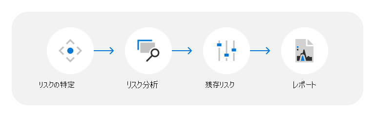

# データセンターの脅威、脆弱性、リスクの評価

Microsoft は、24 時間 365 日、200 を超えるクラウド サービスをお客様に提供しています。 例としては、Microsoft Azure、Microsoft Office 365、Microsoft Dynamics などの法人向けサービスや、Bing、MSN、Outlook.com、Skype、Xbox Live などの一般消費者向けサービスがあります。 これらのサービスは、Microsoft のクラウド インフラストラクチャ (グローバルに分散されたデータセンター、エッジ コンピューティング ノード、サービス運用センター、および世界最大のグローバル ネットワークの 1 つ) でホストされます。を接続する広範なファイバー フットプリントを使用します。 Microsoft は、1989 年に最初のデータ センターを開設して以来、インフラストラクチャへ何十億ドルもの投資を行い、信頼性、拡張性、およびセキュリティが強化されたオンライン サービスの提供に注力すると同時に、サービスの成長に合わせて運用とコストを効率的に管理してきました。

Microsoft クラウド サービスは信頼と安全という土台の上に築かれ、最先端の技術、処理、および暗号化によるクラウド上のお客様のデータとアプリケーションの保護を最重要課題としています。 顧客データは地理的に分散された Microsoft データ センターに保存され、何層にも渡る綿密な論理的および物理的なセキュリティ対策によって保護されています。 Microsoft データ センターは、自然災害、環境の脅威、不正アクセスなどの被害からサービスおよびデータを守るように設計および運用されています。

## 脅威、脆弱性、リスク評価の手法

脅威、脆弱性、リスク評価 (TVRA) プログラムは、Microsoft が物理的および環境的な脅威が Microsoft データセンターに与える影響を特定し、軽減する方法を理解するのに役立ちます。 Microsoft は、改善のためのリスク評価と方法論を継続的に更新し、状況の変化に応じ、継続的に更新します。 その結果、TVRA の分析と結論は変更される可能性があります。レポートはポイントインタイムと見なされます。

Microsoft は、次の手順に従って TVRA プロセスを進めます。

### リスクの特定

TVRAs は、自然および人間が作成した (偶発的な) 危険から生じるさまざまな脅威シナリオを考慮します。 結果は、データセンターの場所、設計、サービスの範囲、およびその他の要因によって異なります。 TVRA は、お客様の要件、独立した国、都市、および第三者のリスク情報によって提供されるリスク環境のサイト レベルの評価に基づいて、TVRA ドキュメントで強調表示する脅威シナリオを選択します。 複数のデータセンターが配置されている地域では TVRA 評価は総計され、評価対象地の物理的および環境的脅威、脆弱性、およびリスクの全体像の把握が図られます。

データセンターの TVRA で評価される脅威のシナリオの種類は次のとおりです。

- **外部の脅威**: 外部の意図的または偶発的な人間の活動に起因するインシデント。 たとえば、市民の混乱、テロ、犯罪活動、外部からの盗難、即席爆発装置、武力攻撃、放火、不正侵入、飛行機墜落事故などです。
- **内部の脅威**: 内部の意図的または偶発的な人間の活動に起因するインシデント。 たとえば、内部の盗難や妨害行為などです。
- **自然災害: データセンター** に悪影響を及ぼす可能性がある自然なプロセスまたは現象。 たとえば、熱帯低気圧、サイクロン、洪水、地滑り、干ばつ、山火事、地震、火山活動、雷雨を伴う暴風、ひょう、強風、豪雨などです。
- **環境上の脅威**: データセンターに悪影響を及ぼす可能性がある環境条件。 たとえば、水ストレス、熱ストレス、パンデミックなどです。

### リスク分析

脅威は、固有のリスクの評価に基づいて評価されます。固有のリスクは、脅威の固有の影響と、管理アクションと制御がない場合の脅威発生の固有の可能性の関数として計算されます。 これらの評価は、内部領域の専門家 (SME) フィードバックと外部リスク インデックスの使用の両方によって通知されます。

### 残存リスク

残存リスクは、制御の有効性を考慮した後の残存リスク レベルの尺度として決定されます。 制御の有効性は、現在の管理措置、および脅威を予防し検出するために設計された制御の指標として評価されます。また、設計され、実装されたものとしての制御が、望ましい効果を発揮する可能性について評価されます。 これらの評価は、TVRA で対処されたデータセンターの場所の制御の有効性に関する内部 SME フィードバックの集約によって通知されます。

### レポート

評価が完了すると、管理承認およびリスク管理に関連する全体的な取り組みをサポートするために、TVRA レポートが生成されます。

## リソース

- [Azure グローバル インフラストラクチャ](https://www.microsoft.com/datacenters)
