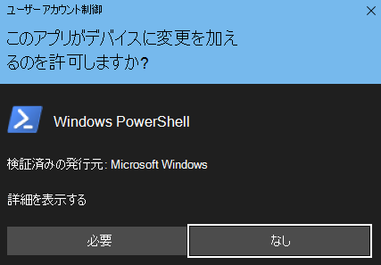

# <a name="fasttrack-migration-toolset-for-submitting-delete-request"></a><span data-ttu-id="07c95-104">削除要求を送信するための FastTrack 移行ツールセット</span><span class="sxs-lookup"><span data-stu-id="07c95-104">FastTrack Migration Toolset for Submitting Delete Request</span></span>

## <a name="toolset-purpose"></a><span data-ttu-id="07c95-105">ツールセットの目的</span><span class="sxs-lookup"><span data-stu-id="07c95-105">Toolset purpose</span></span>

<span data-ttu-id="07c95-p101">FastTrack 移行に関与しているお客様の場合は、ユーザー アカウントを削除しても、Microsoft FastTrack チームが保持しているデータ コピーは削除されません。このデータ コピーは移行を完了する目的でのみ保持されています。移行時に Microsoft FastTrack チームにデータ コピーの削除も依頼する場合は、このツールセットを介してリクエストを送信してください。通常の業務において、移行が完了した時点で、Microsoft FastTrack がすべてのデータ コピーを削除します。</span><span class="sxs-lookup"><span data-stu-id="07c95-p101">In the event that you are a customer currently engaged in FastTrack migrations, deleting the user account will not delete the data copy held by the Microsoft FastTrack team, which is held for the sole purpose of completing the migration. If during the migration you would like the Microsoft FastTrack team to also delete the data copy, submit a request via this tool set. In the ordinary course of business, Microsoft FastTrack will delete all data copies once the migration is complete.</span></span>

### <a name="supported-platforms"></a><span data-ttu-id="07c95-109">サポートされるプラットフォーム</span><span class="sxs-lookup"><span data-stu-id="07c95-109">Supported platforms</span></span>

<span data-ttu-id="07c95-p102">Microsoft は、Windows プラットフォームと PowerShell コンソールでこのツールセットの初期リリースをサポートしています。以下の既知のプラットフォームがこのツールセットでサポートされています。</span><span class="sxs-lookup"><span data-stu-id="07c95-p102">Microsoft supports the initial release of this  toolset in the Windows platform and PowerShell console. The following known platforms are supported by this toolset:</span></span>

<span data-ttu-id="07c95-112">\***表 1 - このツールセットでサポートされているプラットフォーム** _</span><span class="sxs-lookup"><span data-stu-id="07c95-112">\***Table 1 — Platforms supported by this toolset** _</span></span>

<span data-ttu-id="07c95-113">_\*\*\*</span><span class="sxs-lookup"><span data-stu-id="07c95-113">_\*\*\*</span></span>

|<span data-ttu-id="07c95-114">PowerShell バージョン</span><span class="sxs-lookup"><span data-stu-id="07c95-114">PowerShell version</span></span>|<span data-ttu-id="07c95-115">Windows 7</span><span class="sxs-lookup"><span data-stu-id="07c95-115">Windows 7</span></span>|<span data-ttu-id="07c95-116">Windows 8</span><span class="sxs-lookup"><span data-stu-id="07c95-116">Windows 8</span></span>|<span data-ttu-id="07c95-117">Windows 10</span><span class="sxs-lookup"><span data-stu-id="07c95-117">Windows 10</span></span>|<span data-ttu-id="07c95-118">Windows Server 2012</span><span class="sxs-lookup"><span data-stu-id="07c95-118">Windows Server 2012</span></span>|<span data-ttu-id="07c95-119">Windows Server 2016</span><span class="sxs-lookup"><span data-stu-id="07c95-119">Windows Server 2016</span></span>|
|:---:|:---:|:---:|:---:|:---:|:---:|
|<span data-ttu-id="07c95-120">5.0</span><span class="sxs-lookup"><span data-stu-id="07c95-120">5.0</span></span>|<span data-ttu-id="07c95-121">サポート対象外</span><span class="sxs-lookup"><span data-stu-id="07c95-121">Not Supported</span></span>|<span data-ttu-id="07c95-122">サポートされます</span><span class="sxs-lookup"><span data-stu-id="07c95-122">Supported</span></span>|<span data-ttu-id="07c95-123">サポート</span><span class="sxs-lookup"><span data-stu-id="07c95-123">Supported</span></span>|<span data-ttu-id="07c95-124">サポート</span><span class="sxs-lookup"><span data-stu-id="07c95-124">Supported</span></span>|<span data-ttu-id="07c95-125">サポート</span><span class="sxs-lookup"><span data-stu-id="07c95-125">Supported</span></span>|
|<span data-ttu-id="07c95-126">5.1</span><span class="sxs-lookup"><span data-stu-id="07c95-126">5.1</span></span>|<span data-ttu-id="07c95-127">サポート対象外</span><span class="sxs-lookup"><span data-stu-id="07c95-127">Not Supported</span></span>|<span data-ttu-id="07c95-128">サポートされます</span><span class="sxs-lookup"><span data-stu-id="07c95-128">Supported</span></span>|<span data-ttu-id="07c95-129">サポート</span><span class="sxs-lookup"><span data-stu-id="07c95-129">Supported</span></span>|<span data-ttu-id="07c95-130">サポート</span><span class="sxs-lookup"><span data-stu-id="07c95-130">Supported</span></span>|<span data-ttu-id="07c95-131">サポート済み</span><span class="sxs-lookup"><span data-stu-id="07c95-131">Supported</span></span>|
|

### <a name="obtaining-the-toolset"></a><span data-ttu-id="07c95-132">ツールセットの取得</span><span class="sxs-lookup"><span data-stu-id="07c95-132">Obtaining the toolset</span></span>

<span data-ttu-id="07c95-p103">このツールセットは、PowerShell コンソール アプリケーション上の PowerShell ギャラリーで入手できます。このコマンドレット モジュールを検索して読み込むには、まず、PowerShell を管理者モードで開いて、モジュールをインストールするための適切なアクセス許可が付与されるようにします。過去に PowerShell を使用したことがない場合は、Windows のタスク バーに移動して、検索ボックスに「PowerShell」と入力します。右クリックを使用してコンソール アプリケーションを選択し、**[管理者として実行]** を選択してから、**[はい]** をクリックして Windows PowerShell を実行します。</span><span class="sxs-lookup"><span data-stu-id="07c95-p103">This toolset is available in the PowerShell Gallery on the PowerShell console application.  To locate and load this cmdlet module, first open PowerShell in administrator mode so it has the appropriate permissions to install the module. If you have not used PowerShell previously go to your Windows Task Bar and in the search box type “PowerShell”. Select the console app using right-click and choose **Run as administrator**, then click **Yes** to run Windows PowerShell.</span></span>




<span data-ttu-id="07c95-139">コンソールが開いたところで、スクリプトの実行のアクセス許可を設定する必要があります。</span><span class="sxs-lookup"><span data-stu-id="07c95-139">Now that the console is open, you need to set permissions for script execution.</span></span> <span data-ttu-id="07c95-140">次のコマンドを入力して、スクリプトの実行を許可します。</span><span class="sxs-lookup"><span data-stu-id="07c95-140">Type the following command to allow the scripts to run:</span></span>

```powershell
Set-ExecutionPolicy -ExecutionPolicy Bypass -Scope Process
```

<span data-ttu-id="07c95-141">この操作の確認が要求されます。これは、管理者が自分の判断で範囲を変更できるためです。</span><span class="sxs-lookup"><span data-stu-id="07c95-141">You will be prompted to confirm this action, as the administrator can change the scope at their discretion.</span></span>

<span data-ttu-id="07c95-142">\**_実行ポリシーの設定_* _</span><span class="sxs-lookup"><span data-stu-id="07c95-142">\**_Set Execution Policy_* _</span></span>


<span data-ttu-id="07c95-144">これで、スクリプトを許可するようにコンソールが設定されたので、次のコマンドを実行してモジュールをインストールします。</span><span class="sxs-lookup"><span data-stu-id="07c95-144">Now that the console is set to allow the script, run this next command to install the module:</span></span>

```powershell
Install-Module -Name Microsoft.FastTrack -Repository PSGallery -WarningAction SilentlyContinue -Force
```

### <a name="prerequisites-for-module"></a><span data-ttu-id="07c95-145">モジュールの前提条件</span><span class="sxs-lookup"><span data-stu-id="07c95-145">Prerequisites for module</span></span>

<span data-ttu-id="07c95-p105">このモジュールが正常に動作するためには、まだインストールされていない依存モジュールをインストールする必要があります。PowerShell を再起動しなければならない場合があります。</span><span class="sxs-lookup"><span data-stu-id="07c95-p105">To successfully execute this module, you may need to install dependent modules for use if they are not already installed. You may need to restart PowerShell.</span></span>

<span data-ttu-id="07c95-148">DSR を送信するには、最初に Office 365 の資格情報を使用してログインする必要があります。</span><span class="sxs-lookup"><span data-stu-id="07c95-148">In order to submit a DSR, you must first log in using your Office 365 credentials.</span></span> <span data-ttu-id="07c95-149">正しい資格情報を入力すると、グローバル管理者のステータスが検証され、テナントの情報が収集されます。</span><span class="sxs-lookup"><span data-stu-id="07c95-149">Entering the proper credentials will validate your global administrator status and collect tenant information.</span></span>

```powershell
Login-FastTrackAccount -ApiKey <API Key provided by FastTrack MVM>
```

<span data-ttu-id="07c95-150">ログインに成功すると、資格情報とキーが保存され、現在の PowerShell セッションの残りの部分に対して FastTrack モジュールで使用されます。</span><span class="sxs-lookup"><span data-stu-id="07c95-150">Once successfully logged in, the credentials and key will be stored for use with FastTrack modules for the remainder of the current PowerShell session.</span></span>

<span data-ttu-id="07c95-151">商用以外のクラウド環境に接続する必要がある場合は、次の有効な環境のいずれかを使用して、_-Environment\* を *Log in* コマンドに追加する必要があります。</span><span class="sxs-lookup"><span data-stu-id="07c95-151">If you need to connect to a cloud environment, other than commercial, _-Environment\* will need to be added to *Log in* command with one of the following valid environments:</span></span>

- <span data-ttu-id="07c95-152">AzureCloud</span><span class="sxs-lookup"><span data-stu-id="07c95-152">AzureCloud</span></span>
- <span data-ttu-id="07c95-153">AzureChinaCloud</span><span class="sxs-lookup"><span data-stu-id="07c95-153">AzureChinaCloud</span></span>
- <span data-ttu-id="07c95-154">AzureGermanCloud</span><span class="sxs-lookup"><span data-stu-id="07c95-154">AzureGermanCloud</span></span>
- <span data-ttu-id="07c95-155">AzureUSGovernmentCloud</span><span class="sxs-lookup"><span data-stu-id="07c95-155">AzureUSGovernmentCloud</span></span>

```powershell
Login-FastTrackAccount -ApiKey <API Key provided by FastTrack MVM> -Environment <cloud environment>
```

<span data-ttu-id="07c95-156">DSR 要求を送信するには、次のコマンドを実行します。</span><span class="sxs-lookup"><span data-stu-id="07c95-156">To submit a DSR request, run the following command:</span></span>

```powershell
Submit-FastTrackGdprDsrRequest -DsrRequestUserEmail SubjectUserEmail@mycompany.com
```

<span data-ttu-id="07c95-157">成功した場合、コマンドレットによってトランザクション ID オブジェクトが返されます。</span><span class="sxs-lookup"><span data-stu-id="07c95-157">On success, the cmdlet will return a Transaction ID object.</span></span> <span data-ttu-id="07c95-158">このトランザクション ID は、保管してください。</span><span class="sxs-lookup"><span data-stu-id="07c95-158">Please retain the Transaction ID.</span></span>

#### <a name="checking-the-status-of-a-request-transaction"></a><span data-ttu-id="07c95-159">要求トランザクションの状態の確認</span><span class="sxs-lookup"><span data-stu-id="07c95-159">Checking the status of a request transaction</span></span>

<span data-ttu-id="07c95-160">先ほど取得したトランザクション ID を使用して、次の関数を実行します。</span><span class="sxs-lookup"><span data-stu-id="07c95-160">Run the following function using the previously obtained Transaction ID:</span></span>

```powershell
Get-FastTrackGdprDsrRequest -TransactionID "YourTransactionID"
```

#### <a name="transaction-status-codes"></a><span data-ttu-id="07c95-161">トランザクション状態コード</span><span class="sxs-lookup"><span data-stu-id="07c95-161">Transaction Status Codes</span></span>

|<span data-ttu-id="07c95-162">トランザクション</span><span class="sxs-lookup"><span data-stu-id="07c95-162">Transaction</span></span>|<span data-ttu-id="07c95-163">状態</span><span class="sxs-lookup"><span data-stu-id="07c95-163">Status</span></span>|
|---|---|
|<span data-ttu-id="07c95-164">**Created**</span><span class="sxs-lookup"><span data-stu-id="07c95-164">**Created**</span></span>|<span data-ttu-id="07c95-165">要求が作成されました。</span><span class="sxs-lookup"><span data-stu-id="07c95-165">Request has been created.</span></span>|
|<span data-ttu-id="07c95-166">**Failed**</span><span class="sxs-lookup"><span data-stu-id="07c95-166">**Failed**</span></span>|<span data-ttu-id="07c95-167">要求を作成できませんでした。再送信するか、サポートにお問い合わせください。</span><span class="sxs-lookup"><span data-stu-id="07c95-167">Request failed to create, please resubmit, or contact support.</span></span>|
|<span data-ttu-id="07c95-168">**Completed**</span><span class="sxs-lookup"><span data-stu-id="07c95-168">**Completed**</span></span>|<span data-ttu-id="07c95-169">要求が完了してサニタイズされました。</span><span class="sxs-lookup"><span data-stu-id="07c95-169">Request has been completed and sanitized.</span></span>|
|

<!-- original version: **Created**  Request has been created<br/>**Failed** Request failed to create, please resubmit, or contact support<br/>**Completed** Request has been completed and sanitized -->

## <a name="learn-more"></a><span data-ttu-id="07c95-170">詳細情報</span><span class="sxs-lookup"><span data-stu-id="07c95-170">Learn more</span></span>

[<span data-ttu-id="07c95-171">Microsoft Trust Center</span><span class="sxs-lookup"><span data-stu-id="07c95-171">Microsoft Trust Center</span></span>](https://www.microsoft.com/trust-center/privacy/gdpr-overview)
